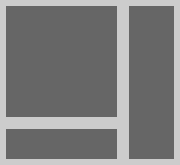

# The *boxes* module

This module is designed to layout boxes on a page or in a figure. You specify
constraints such as

- This box has an aspect ratio of 3:2.
- The height of this box is the same as that one.
- These four boxes should lie in a grid.
- The complete figure has a width of 12 cm.

and this library will find a set of coordinates that satisfies the constraints.

Here is some example code:

```python
import boxes

grid = boxes.Grid(2, 2, width=6.0)  # a two-by-two grid, 6 units wide
box1 = boxes.Box(aspect=1)          # a square box of any size
box2 = boxes.Box(width=1.5)         # a 1.5 unit wide box
box3 = boxes.Box(height=1.0)        # a 1.0 unit tall box

grid[0, 0].fix(box1)     # put box1 in the top left corner
grid[:, 1].fix(box2)     # put box2 across the two cells on the right
grid[1, 0].fix(box3)     # put box3 in the bottom left corner

grid[:, :].spacing(0.4)  # set spacings everywhere in the grid to 0.4 units
grid.margins(all=0.2)    # Set margins outside the grid to 0.2 units

# Solve the layout
sls = grid.solve()

total_size = sls.eval(grid.size)
print('The size of the figure is {:.2f} × {:.2f}.'.format(*total_size))
box3_loc = sls.eval(box3.loc)
print('box3 is located at ({:.2f}, {:.2f}).'.format(*box3_loc))
```

The above code creates the layout shown below



## Requirements

The *boxes* module depends on

- Python 3 (python 2 is not supported, sorry).
- *numpy* (used internally to solve the constraints).

## Using with *matplotlib*

The *boxes* module was written as a more powerful alternative to the subfigure
support of *matplotlib* and provides some glue code for this usage. Here is an
example

    # TODO

## How it works

The *boxes* module is built on top of *boxes.symmath* which is a library for
cleanly expressing and solving systems of linear equations. *symmath* provides a
class to represent linear expressions and this class emulates a numerical type.
*numpy* is used by *symmath* to do the actual work of solving the linear systems
thus represented.
